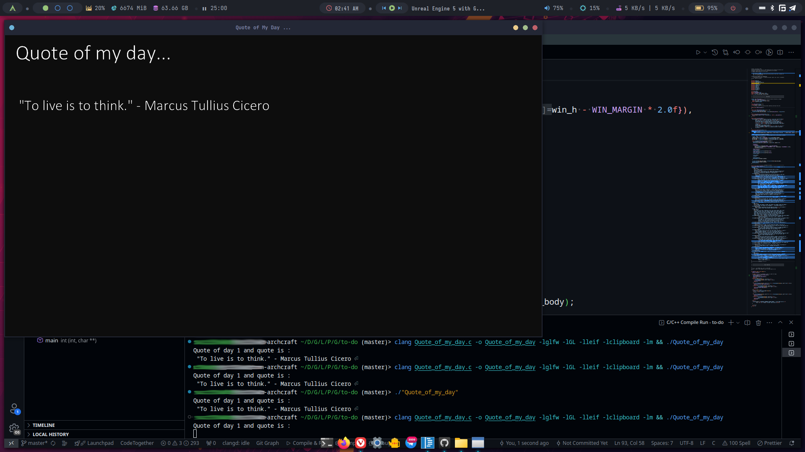

# Quote-of-my-day
This is a GUI desktop app written in C for PERSONAL USE which will remind me a quote every day from its internally predetermined 31 quotes

This was a hobby project made for personal usage

I an thankful to @cococry for [leif library in C](https://github.com/cococry/leif.git)

### Screenshots:

---

Kazi Rifat Morshed
CSEKU230220
August 2024
Sonadanga, Khulna.
